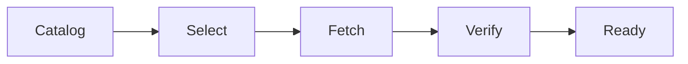

# jetbrains-full-version-manager 🧩🗂️

  

*A calm, organized way to track, fetch, and manage JetBrains IDE builds — without the spreadsheet chaos.*

  

---

## 📋 Requirements Matrix

Before anything else, here's what your machine needs. We keep the bar low on purpose — this tool is meant to run on ordinary developer hardware, not a dedicated build server.

| Component | Minimum | Recommended |
|---|---|---|
| **OS** | Windows 10 (64-bit) | Windows 11 (64-bit) |
| **RAM** | 4 GB | 8 GB or more |
| **Disk** | 500 MB free (app + cache) | 5 GB+ free (multiple IDE versions cached locally) |

> [!NOTE]
> Disk requirements scale with how many JetBrains IDE versions you keep cached locally. The manager itself is lightweight; the versions you download are not.

---

## 🔭 Overview

**jetbrains-full-version-manager** is a desktop utility built to solve a very specific, very ordinary problem: JetBrains ships a lot of IDEs — IntelliJ IDEA, PyCharm, WebStorm, Rider, CLion, GoLand, and more — and each one has a long history of versions. Developers routinely need to pin a specific build for a client project, reproduce a bug that only exists in an older release, or test compatibility across a plugin's supported version range. Doing this manually means bouncing between changelogs, archive pages, and mismatched installer names. This project exists to make that process orderly and repeatable.

The tool acts as a structured front-end for **JetBrains full version download** workflows — presenting version history, release channels (EAP, Release, Long-Term Support), and build metadata in one consistent interface. Rather than guessing which archive link corresponds to which patch, you get a searchable, filterable list with clear labeling, so the version you select is the version you actually run.

It's built for developers who value precision over convenience shortcuts: teams that need deterministic environments, QA engineers reproducing version-specific bugs, and anyone who's ever lost twenty minutes hunting for "that one build from last spring." The interface is intentionally unglamorous — this is infrastructure, not a showcase — and it's designed to get out of your way once it's done its job.

---

## 🧠 What It Actually Does

- **Version cataloging** — maintains a browsable, searchable index of JetBrains IDE releases across product lines, so you're never scrolling through unrelated changelogs to find the one build you need.

- **Channel awareness** — distinguishes between EAP, Release Candidate, and stable channels, labeling each clearly so you don't accidentally grab a nightly build when you meant a stable one.

- **Local build tracking** — keeps a record of which versions you've already downloaded and where, preventing duplicate fetches and wasted disk space.

- **Metadata-first design** — every entry shows build number, release date, and platform target before you commit to a download, turning guesswork into a quick glance.

- **Side-by-side comparison** — lets you line up two versions to see what changed between them, useful when isolating a regression.

- **Offline-friendly cache view** — once versions are stored locally, the tool works entirely without a network connection for browsing and launching.

- **Clean uninstall tracking** — knows what it put where, so removing an old version doesn't leave orphaned files behind.

- **Portable operation** — runs from a single folder with no system-wide footprint, ideal for shared machines or locked-down environments.

> [!TIP]
> If you manage multiple IDE families (say, IntelliJ *and* Rider), use the filter bar to scope the catalog to one product line at a time — it keeps the list readable.

---

## 🚀 Getting Started

1. **Visit the landing page** using the download button below — this is the only official distribution point for the tool.

2. **Download the latest build** for Windows. No installer wizard, no bundled extras.

3. **Run the executable directly.** The app opens to the version catalog; no setup screens to click through.

4. **Browse, select, and manage** JetBrains versions from the interface. Your local cache builds up as you go.

> [!IMPORTANT]
> Always download from the official landing page linked in this README. Third-party mirrors are not maintained by this project and cannot be verified.

---

## 💻 System Requirements

| OS | RAM | Disk |
|---|---|---|
| Windows 10 / 11 (64-bit) | 4 GB minimum, 8 GB recommended | 500 MB app + variable cache (plan for 5 GB+) |

- Standalone executable — no runtime dependencies to install separately.

- No background services; the app runs only while open.

- Works on both consumer and enterprise-managed Windows machines, though admin-restricted environments may need IT approval for first launch.

---

## ⚙️ How It Works

The internal flow is intentionally simple — a straight pipeline rather than a tangle of background processes:

1. **Catalog sync** — the app checks its bundled/refreshed index of known JetBrains version metadata.

2. **User selection** — you pick a product, channel, and specific build from the filtered list.

3. **Fetch & verify** — the selected version is retrieved and checked against its recorded metadata (size, build ID).

4. **Local registration** — the build is added to your local cache index so it shows up as "already downloaded" next time.

5. **Launch or archive** — you either open the IDE directly or leave it cached for later use.

> [!NOTE]
> Verification is metadata-based (size and build ID checks), not a substitute for your own security review of anything you run.

---

## 🛟 Troubleshooting

<strong>The catalog list looks outdated — how do I refresh it?</strong>

Use the refresh action in the top bar. The catalog metadata updates independently of the app binary itself, so a refresh is usually enough without needing a new build of the tool.

<strong>A specific IDE version isn't showing up in the list.</strong>

Very old or very niche EAP builds are sometimes pruned from the default view to keep the catalog readable. Check the "Show all channels" toggle in settings before assuming it's missing entirely.

<strong>Windows SmartScreen flagged the executable on first run.</strong>

This is common for newer, less widely-distributed binaries. Verify you downloaded from the official landing page, then choose "More info → Run anyway" if you're confident in the source.

<strong>My downloaded version won't launch.</strong>

Confirm the build matches your system architecture (most modern JetBrains IDEs ship 64-bit only now). Re-checking the metadata panel before launch usually clarifies this.

<strong>Can I run multiple versions of the same IDE side by side?</strong>

Yes — each cached version is stored in its own isolated folder, so IntelliJ 2024.1 and 2025.3, for example, can coexist without conflict.

<strong>Does this modify my existing JetBrains Toolbox installation?</strong>

No. This project is independent and does not read from or write to Toolbox's configuration or install directories.

---

## 🎨 Interface & Experience

- **Keyboard-first navigation** — arrow keys move through the catalog, `Enter` opens details, `Ctrl+F` jumps to search.

- **Light and dark themes**, following your Windows system preference by default, with a manual override in Settings.

- **Persistent filters** — your last-used product/channel filter is remembered between sessions.

- **Compact and detailed list views** — toggle depending on whether you want density or metadata visibility.

- **Status bar feedback** — every fetch or verification step shows live progress, no silent waiting.

> [!TIP]
> `Ctrl+K` opens a quick-jump command palette if you know roughly what you're looking for and don't want to scroll.

---

## 🤝 Contributing & Community

This project grows through the people who use it daily and notice where it falls short. Contributions of all sizes are welcome:

- **Bug reports and feature requests** — open an issue with as much context as you can offer; screenshots and version metadata help a lot.

- **Pull requests** — check open issues tagged `good first issue` if you're contributing for the first time.

- **Discussions** — use the Discussions tab for roadmap ideas, workflow questions, or just to share how you're using the tool.

- **Roadmap** — planned areas include broader product-line coverage, improved offline caching, and community-suggested UI refinements. Priorities shift based on what the community actually asks for, so weigh in early.

> [!WARNING]
> Please avoid opening issues that ask for redistribution of proprietary JetBrains installers outside official channels. This project indexes and manages versions — it does not host or repackage them.

---

## 📄 License

Released under the [MIT License](LICENSE), 2026. Use it, fork it, adapt it — attribution appreciated but the terms are permissive by design.

---

## ⚠️ Disclaimer

This project is an independent, community-maintained tool and is not affiliated with, endorsed by, or sponsored by JetBrains s.r.o. All product names, logos, and brands referenced are the property of their respective owners. Users are responsible for complying with JetBrains' own licensing terms for any IDE versions they download and run.

---

